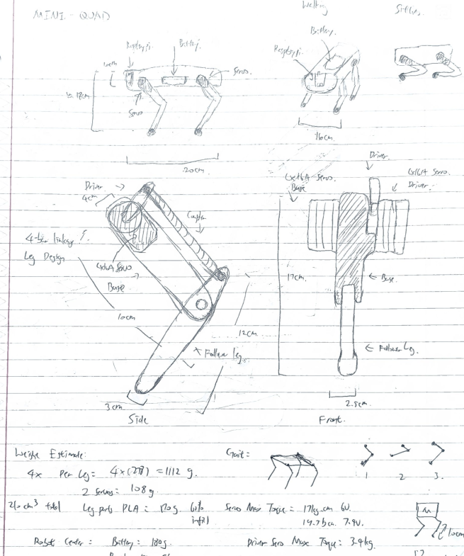

+++
title = "Quadupedal Robot"
description = "Designing and implementing a Quadupedal Robot to walk"
date = 2026-09-10
[extra]
lang = "en"
toc = true
+++

This project is part of MECE 4611 Robotics Studio.

## Sketch Design

## Premiliary CAD Model Design 1

{{ <figure src="CAD1.png" alt="Fusion 360 screenshot of the assembled robot, with the component tree listing the carbon fiber tubes, servo mounts, batteries, shells and Raspberry Pi" width="1094" height="480" page /> }}

{{ <figure src="CAD2.png" alt="Two views of the design: the assembled robot in isometric view, and a side view of the body with both 4-bar linkage legs" width="1094" height="480" page /> }}

{{ <figure src="CAD3.png" alt="CAD view of the assembled body showing where the batteries and the Raspberry Pi sit" caption="Placement of batteries and Raspberry Pi" width="1094" height="480" page /> }}

{{ <figure src="CAD4.png" alt="CAD view of the body structure" caption="Body uses carbon fiber tubes for strength" width="972" height="460" page /> }}

{{ <figure src="CAD5.png" alt="Exploded CAD view separating the body from the leg assemblies" caption="Body and leg exploded view" width="972" height="460" page /> }}

## Premiliary CAD Model Design 2
