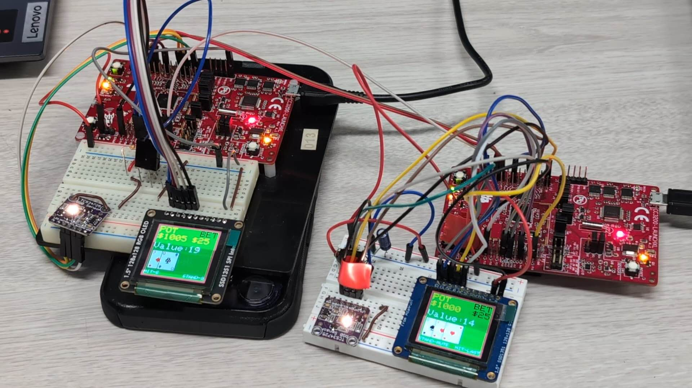
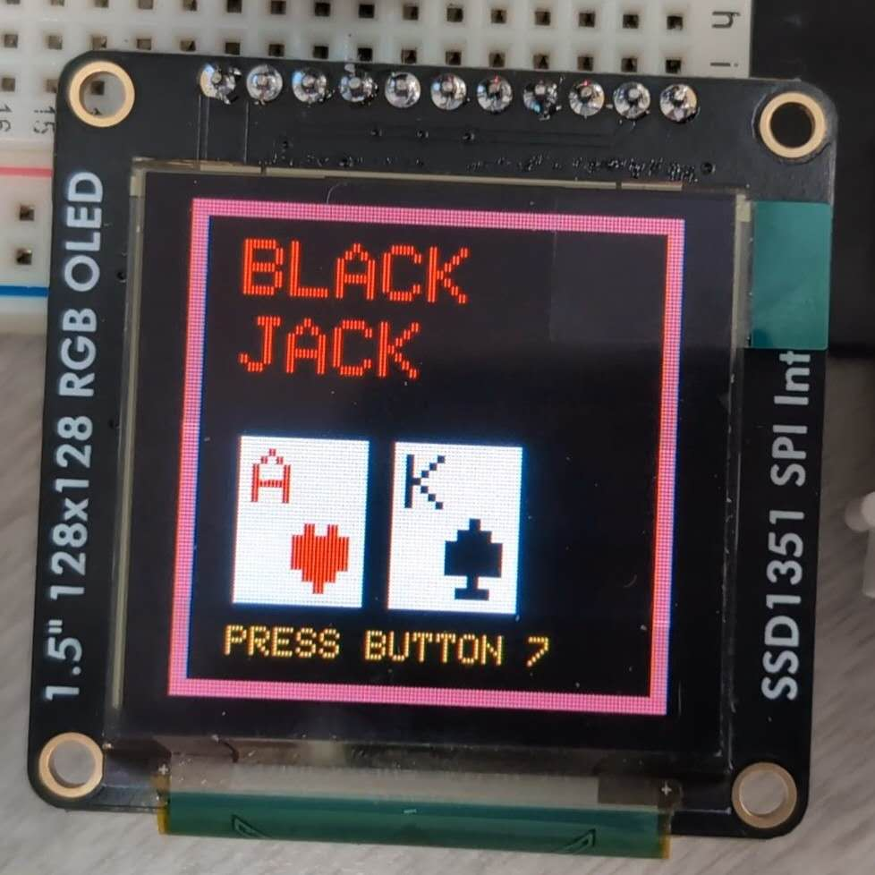
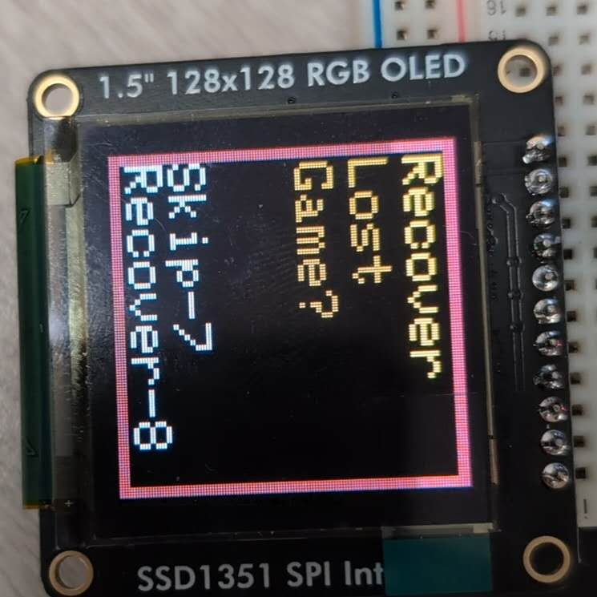

# BlackJack 
Playing BlackJack with two CC3200 Launchpads

## Project Description
Card Game Implementation

Card Rendering & UI Design:
We began by implementing the card component on our OLED. Using techniques from our in-class Lab 2, we developed a function to draw cards by:

-Drawing a rectangle to represent the card.

-Calculating the text placement based on the rectangle’s dimensions and calling a text-drawing function (Outstr) to render the card’s value and suit.

-Automatically setting the text color according to the suit.

Card values and suits are stored as characters and integers—with ten represented by a 'T' that the function converts into two digits. We defined a specific region on the OLED where cards are drawn. The rest of the UI was built using trial and error: drawing rectangles for casino table borders, using a green background to mimic felt, and placing text to guide the player.

Screen Flow & Game Logic:

After connecting to AWS, the game displays a welcome screen. The next screen lets the player choose to recover a lost game state or proceed to betting. In the betting screen, physical poker chips are scanned using our color sensor, adding their value to the player’s bet. Once the bet is confirmed, the game moves to the final screen where the player can choose to hit or stand. A UART connection then transmits the chosen values and bets between two microcontrollers to determine the winner and update the player’s pot. The game continues until a player ends the session or runs out of funds.

Color Sensor Integration:

We used the TCS34725 color sensor from Adafruit. Although a library existed for this sensor (designed for Arduino), we needed to translate its C++ functions into C to work reliably on our CC3200.

UART & AWS Communication:

Both the UART and AWS implementations required careful string parsing and construction. For UART, values and bets were separated by commas to ensure consistent parsing. For AWS, we constructed JSON-formatted strings to send arrays of card values and suits. We used our AWS integration to save game states (cards in hand, bet placed, and pot value) that could be recovered on a crash.

Game Flow Summary:

The player connects to WiFi/AWS and views the title screen.
The player can recover a saved game state or proceed to betting.
Poker chips are scanned via the color sensor to set bets.
The player chooses to hit or stand; the microcontrollers communicate via UART to determine the winner.
The game continues round-by-round until the session ends or funds run out, with AWS available for game recovery if needed.

#### Welcome Screen

#### Recovery UI

#### Betting UI

#### Game UI

### Video Demonstration
<video width="320" height="240" controls>
  <source src="content/IMG_0210.mp4" type="video/mp4">
  <source src="content/IMG_0210.MOV" type="video/quicktime">
  Your browser does not support the video tag.
</video>

